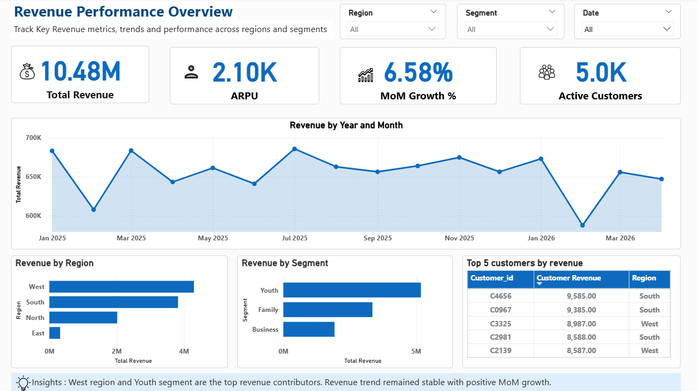
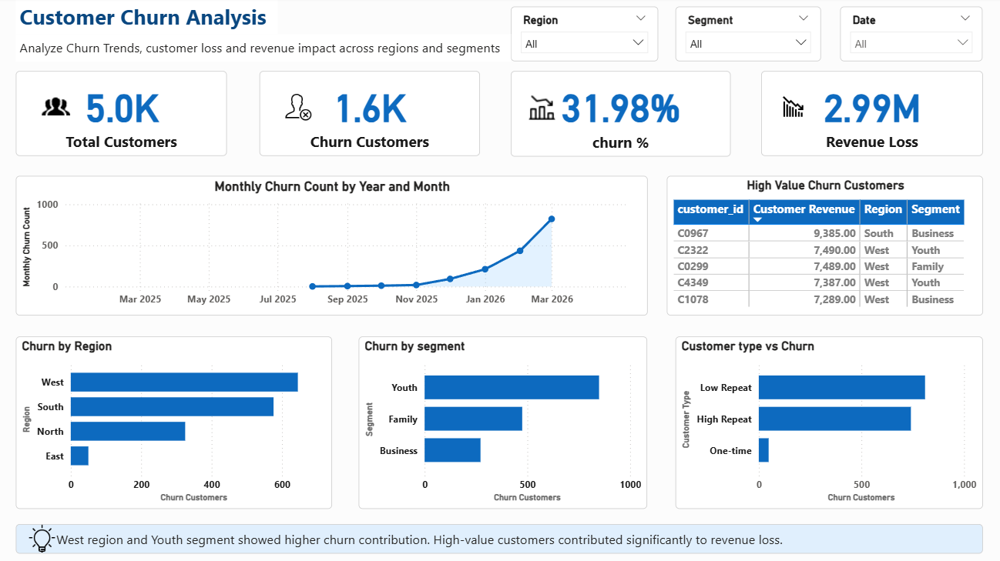

# Telecom Revenue and Customer Churn Analysis
## Project Overview 
Developed an end-to-end analytics solution to analyze revenue performance, understand customer churn behavior, map revenue loss, and identify high-value customer segments to generate actionable business insights.This project showcases how raw telecom data is transformed into structured database layers and visualized through an interactive dashboard.

---
## Business Problem & Objectives
In the telecom industry, retaining high-value customers and maintaining a strong Average Revenue Per User (ARPU) is critical.This project targets:
* Identifying high-risk customers who are likely to churn based on recent inactivity.
* Cleaning, transforming, and validating raw data for precise dashboard metrics.
* Monitoring monthly revenue trends to isolate specific segment-wise revenue drops.
  
---
## Tech Stack & Skills Demonstrated
* Database Management: SQL Server (SSMS)
* Business Intelligence: Microsoft Excel & Power BI
* SQL Mastery: CTEs, Joins, Window Functions ('ROW_NUMBER()'), Date Manipulation ('DATEADD', 'TRY_CONVERT'), Data Cleaning, View Creation, and Validation of Cleaned Views.
* Power BI Mastery: Data Modeling, Star Schema, Advanced DAX, and Interactive Executive Dashboarding.
  
---
## Project Architecture & Backend SQL Logic
The backend layer consists of optimized production-ready SQL scripts divided into two key areas:
### 1. Data Cleaning & Structured Reporting Views
Created optimized database views ('vw_customer_clean', 'vw_recharge_clean', 'vw_usage_clean', 'vw_date_clean') to automate data pipeline cleaning:
* Eliminated NULL values and managed strict data-type casting using 'TRY_CONVERT' and 'ISNULL'.
* Handled inconsistent text fields (e.g.,standardizing text inputs for states like 'Maharashtra').
* Embedded business sanity checks and row-count comparisons to validate raw vs. cleaned record sets.

### 2. Churn Analytics Logic ('vw_churn_customers')
Implemented a robust business definition to accurately isolate churned customers using key inactivity flags:
* Usage Check: Filtered for customers showing zero data (MB) or call activity in the last 30 days.
* Recharge Check: Cross-referenced payment history to isolate profiles with zero recharges in the last 45 days.
* Used CTEs and LEFT JOIN to dynamically calculate maximum thresholds without capturing completely inactive test records.
  
---
## Power BI Data Modeling & Dashboard Highlights
The corresponding '.pbix' reporting file connects directly to the cleaned SQL views. To ensure optimal performance and deep insights, the Power BI solution includes:
### 1. Robust Data Modeling (Star Schema)
* Established One-to-Many Relationships between the dimension tables('Customer', 'Date') and fact tables ('Recharge', 'Usage').
* Used common keys like 'Customer ID' and date fields to enable seamless, dynamic cross-filtering across all report pages.

### 2. Advanced Analytics & Dax Formulas
Formulated complex DAX measures and calculated columns to track business-critical telecom KPIs, utilizing functions like 'SUM', 'CALCULATE', 'FILTER', 'DISTINCTCOUNT', and 'IF' to measure:
* Core Metrics: Total Revenue, Average Revenue Per User (ARPU), and Active Customers.
* Trend Analysis: Month-over-Month (MoM) Growth %, Churn Rate %, and Total Revenue Loss.

### 3. Interactive Executive Dashboard Design
Built a structured 2-page dashboard tailored for retention management:
* Page 1 (Revenue Performance): Visualizes monthly revenue movements, region-wise trends and segment-wise metrics to pinpoint top-performing areas.
* Page 2 (Customer Churn Analysis): Tracks churned customers, identifies high-risk customers, and map revenue loss to provide actionable lists for proactive marketing retention strategies.

---
## Dashboard Preview

### Page 1: Revenue Performance

### Page 2: Customer Churn Analysis

